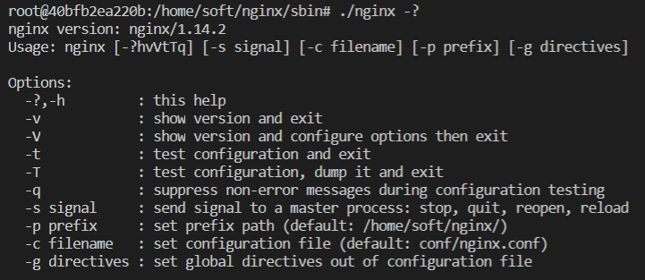

# happykala_nginx
1,2、mind图的说明  
## 2.1、nginx提供的主要服务点：  
nginx提供的常用服务包含：  
1）静态资源访问，比如应用中使用的一些图片，css样式文件，js文件，甚至于长时间不变的整个的html页面都可以作为静态资源，使用nginx去访问，这样能够有效的提高用户的使用体验；  
2）反向代理：反向代理是指的代理服务器接收客户端的请求，然后将请求转发给应用服务器，应用服务器得到结果后给到代理服务器，代理服务器再回馈给用户，反向代理衍生出两个功能点：  
      2.1)缓存加速，提供给用户的应用，随着用户规模增加或者其他原因，用户的延时体验会越来越明显，这样的情况下，我们可以把一些长期不变的资源在nginx部分缓存，由nginx提供服务，不再通过应用服务器，这可以极大的加速用户访问速度【其实这个和静态资源服务器的区别，我还有点疑惑，是说nginx作为静态资源服务器只返回静态资源，不做动态数据返回，但是缓存加速是一个小体量的静态资源服务器，我目前的理解是这样的，后期可以再补充】  
      2.2）负载均衡：这是一个很重要的问题，随着应用功能体量以及用户体量的增加，我们不可避免的需要考虑容灾处理和访问均分，以及动态扩容的问题，nginx作为前置的边缘代理，其本身的特性可以比较好的支持这些功能的实现；  
3）API服务，实话说这个我没怎么用到过，查找的资料是说，在数据库服务器的性能优于应用服务器的时候，nginx可以通过一些扩展库直接连接操作数据库，比如openresty；  

## 2.2、nginx的核心优点：  
1）高性能，高并发：  
nginx在底层设计上使用了I/O多路复用的技术，能够极大的挖掘硬件服务器本身的性能，一个简单的例子nginx启动后会有一个master进程和若干个work进程，master负责请求分发，work处理具体的连接功能；  
2）高可扩展性：  
nginx提供了很多的扩展模块，我们可以使用现成的模块编译出处理特定需求的nginx服务器；  
3）高可用性：  
nginx在运行稳定性上很优秀，可以长时间提供稳定的web服务；  
4）热部署：  
nginx的热部署功能很重要，很多应用服务在升级或者某些特定操作的时候需要停掉服务，但是nginx支持热部署和热升级，避免出现一些不可预期的错误；  
5）BSD许可：  
nginx的BSD许可在我们需要定制自己特需的服务器时，我们可以修改nginx的源码，这些行为在商业应用上是被允许的；  

## 3.nginx的四个组成部分：  
nginx的可执行二进制文件 这个是nginx的源码和附加的模块编译出来的功能文件  
nginx.conf nginx的配置文件，可执行文件的行为控制文件  
access.log 访问日志，所有通过nginx的请求都会在access.log中做记录  
error.log 错误日志非预期的错误记录文件  

对于access.log，我们可以分析其中的访问数据，来做一些访问限制或者业务过滤，以及对于接口访问的分析等等工作，比如我们可以监测一个固定ip对平台的访问，分析指定接口的访问次数，分析访问行为等等  

对于error.log文件主要用来记录nginx的访问错误信息，可以用来做业务相关的回盘  

## 4.nginx的源码目录结构：    
nginx的官网地址：http://nginx.org/  
nginx的下载地址和说明：http://nginx.org/en/download.html  
  
图中的第一个标记表示的是当前的最新版本，可能包含一些最新的特性功能  
图中的第二个标记表示的是当前的稳定版本，一般用于生产环境
|序号|目录|说明|
|:---|:---|:---|
|1|auto|cc,lib库，已经一些用于编译安装的系统判别辅助文件|
|2|CHANGES和CHANGES.RU|版本变化说明文件分别是英文版本和俄语版本，里面主要包含没有版本的新特性和bugfix修复情况|
|3|conf|配置文件的模板目录|
|4|configure|编译工具|
|5|contrib|vim语法辅助配置|
|6|html|默认的错误和欢迎首页，初始状态是是index.html文件和处理500错误的html文件|
|7|man|liunx下的nginx配置帮助文件|
|8|src|nginx源码目录|

## 5.一个典型的nginx手动编译配置过程和说明  
nginx的安装主要有两种方式：  
1、使用yaml或者apt一类的工具去安装；  
2、源码编译的方式去安装；  
一般情况下建议使用源码安装，使用这种方式可定制化的编译出自己需要的nginx安装文件  
### 5.1、下载nginx源码  
```shell
wget http://nginx.org/download/nginx-1.14.2.tar.gz
```
这里下载的是一个1.14.2版本的nginx  
### 5.2、nginx文件下载文件解压
tar -zxvf nginx-1.14.2.tar.gz 解压之后的文件目录对应第4节中的说明即可  
### 5.3、配置处理  
命令行是./configure #### 其中####代表使用的编译参数，可用的编译参数使用./configure --help可以得到一个比较全的说明  
编译参数主要分为四个类别：  
1、安装地址参数，用来限定nginx的安装目录，例子如下：  
  
2、模块限定参数，以--with开头，表示的是官方的nginx没有默认编译到包中的模块，例子如下：  

3、模块限定参数，以--without开头，表示官方默认编译的包，我们现在不想编译进去，例子如下：  

4、额外的编译参数【这个感觉用到的比较少】，例子如下：  
  
需要说明的是在configure的过程中可能会出现各种环境问题，那就根据实际情况去处理即可
### 5.4、编译和安装  
如果是初次安装可以直接执行:  
```
make && make install
```
如果不是初次安装或者设计nginx版本升级，执行完了```make```之后，可以不用执行```make install```,将objs目录下的nginx*二进制可执行文件放到原来nignx安装目录下的sbin目录下即可  

## 6、nginx的重载，热部署和日志切割  
首先需要了解nginx的常用命令行，可以参考`8、nginx的命令行操作.emmx`文件  
使用nginx -?或者-h得到的操作提示如下：  
  
上图中描述了命令行的指令和指令参数  
### 6.1、nginx重载  
在修改了nginx配置文件的时候使用`nginx -s reload`命令行可以实现平滑的配置文件重载  
## 6.2、热部署  
nginx的如数的步骤：  
1、备份旧版本的二进制文件  
2、将高版本的二进制文件拷贝到sbin目录中  
3、发送USR2信号，使用新的二进制文件创建处理进程
命令行是kill -USR2 #进程数#  
4、发送WINCH信号关闭老的work进程
命令行是kill -WINCH #进程数#  


